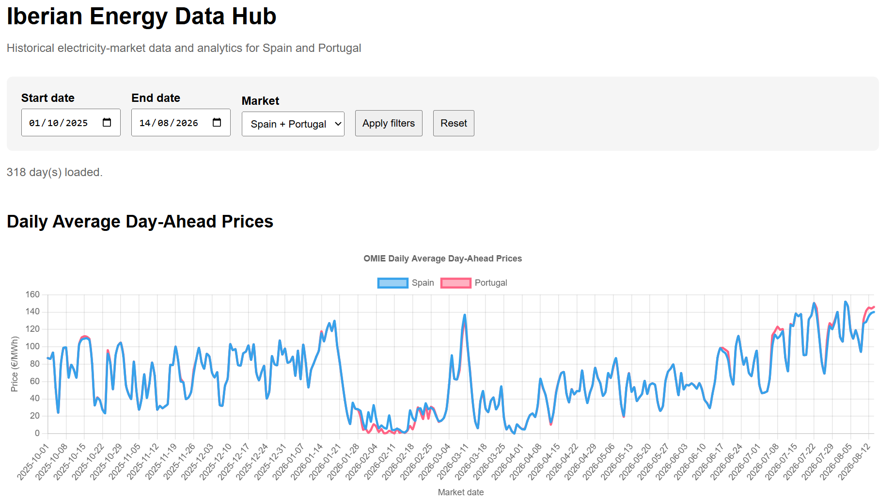

# Iberian Energy Data Hub

A personal data engineering and analytics project for exploring the Spanish and Portuguese electricity markets.

The project collects historical electricity-market data from official sources, processes and validates it, stores it in a structured SQLite database, exposes it through a FastAPI API, and visualizes it in an interactive web dashboard.

## Dashboard



## Project objective

The goal of the Iberian Energy Data Hub is to build a structured and reproducible database of key variables in the Spanish and Portuguese electricity markets.

The project is designed both as an analytical tool and as a practical exercise in working with real energy-market data.

The current focus is on:

- Day-ahead electricity prices in Spain and Portugal
- Portuguese electricity load
- Portuguese electricity generation by technology
- Spain–Portugal price spreads and market splitting
- Historical and intraday market analysis

Additional market fundamentals will be added progressively.

## Current data sources

### OMIE

OMIE day-ahead market data is used for electricity prices in:

- Spain
- Portugal

The project processes quarter-hourly market periods and handles daylight-saving-time days with 92, 96 or 100 periods.

### REN

REN data is currently used for Portuguese electricity-market fundamentals, including:

- Actual electricity load
- Hydro generation
- Solar generation
- Wind generation
- Natural gas generation
- Biomass generation
- Other thermal generation
- Coal generation
- Wave generation

## Historical dataset

The validated OMIE and REN load datasets currently cover:

**1 October 2025 – 14 August 2026**

This corresponds to:

- 318 consecutive market days
- 30,528 quarter-hour observations for Portuguese prices
- 30,528 quarter-hour observations for Portuguese electricity load

The two datasets have been independently validated and aligned using UTC timestamps.

Validation confirmed:

- No missing market dates
- No null observations
- No duplicate timestamps
- Correct daylight-saving-time treatment
- Correct market-period sequences
- 30,528 exact OMIE–REN timestamp matches
- No market-date mismatches
- No period-number mismatches

## Architecture

```text
Official data sources
        |
        v
Python collectors
        |
        v
Raw source files
        |
        v
Processing and validation
        |
        v
SQLite database
        |
        v
SQL analytics
        |
        v
FastAPI
        |
        v
Interactive web dashboard
```

## Live Demo

[Open the Iberian Energy Data Hub](https://iberian-energy-data-hub.onrender.com/)

> **Public demo note:** The live deployment uses a sanitized OMIE-only dataset.
> REN load and generation data are used in the local research environment and
> are not redistributed through the public deployment.